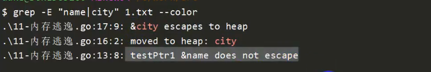

# **GO语言特点**
1. 没有头文件概念，.go走天下
2. 强类型语言，编译型语言
3. 一个go语言的应用程序，在运行的时候不需要依赖外部库的
   1. 把执行时需要的所有库都打包走在程序中
   2. go程序比较大
   3. 如果import的包在程序中没有使用，那么程序不允许编译
4. go语言不区分平台（跨平台），在windows下面也可以编译一个程序，在linux下运行，需要两个环境变量控制
   1. GOOS：设定运行的平台
   > mac：GOOS=darwin  linux:GOOS=linux   windows:GOOS=windows
   2. GOARCH:目标平台的体系结构（
   > 386：GOARCH=386  amd64:GOARCH=amd64   arm:GOARCH=arm


# **GO命令(build/run/install/env)**
编译.go文件,-o指定生成文件命令
```shell
go build -o main.exe main.go xxx.go 
```
直接运行程序，不会编译成exe文件
```shell
go run *.go
```
安装程序

- C语言安装程序步骤
```shell
./configure
make
make install ===>将编译好的程序安装到指定的目录/usr/bin
```
- 使用go install，可以将应用程序安装在GOBIN下面的$GOPATH/bin下
```
go build *.go
go install
```
- 查看当前环境变量
```
go env
```
- 如果重新设置了环境变量需要重新启动GOLAND

# **基础数据类型**
> int int8 int16 int32 int64
> 
> uint8....uint16
> 
> float32 float64
> 
> true/false
- 自增语法
```
// C语言
i++,i--,--i,++i
// Go语言
i++,i-- 没有--i,++i 自增语法必须单独一行
```

# **指针**
```go
package main

import "fmt"

func main() {
	//go语言也有指针
	//结构体成员调用时   c语言 ptr->name  go语言 ptr.name
	//go语言使用指针是会使用内部的垃圾回收机制（GC（grabage collector）机制），开发人员不需要手动释放内存
	//C语言不允许返回栈上指针，go语言可以返回栈上指针，程序会在编译的时候就确定变量的分配位置
	//编译的时候，如果发现有必要的话，就将变量分配到堆上

	name := "lily"
	ptr := &name
	fmt.Println("name:", name)
	fmt.Println("ptr:", ptr)

	//02-使用new关键字定义
	name2ptr := new(string)
	*name2ptr = "Duke"
	fmt.Println("name2ptr:", *name2ptr)
	fmt.Println("name2ptr ptr:", name2ptr)

	//可以返回栈上的指针，编译器在编译程序时，会自动判断这段代码，将city变量分配在堆上,内存逃逸
	res := testPtr()
	fmt.Println("res:", *res, "res add:", res)
	//空指针，在c语言：null c++：nullptr go：nil
	//if语句即使一行代码也必须使用{}
	if res == nil {
		fmt.Println("res是空，nil")
	} else {
		fmt.Println("res非空")
	}
}

//定义一个函数韩惠一个string类型指针，go语言返回值写在参数后
func testPtr() *string {
	city := "成都"
	ptr := &city
	return ptr
}

```

# **go与c相比不支持语法汇总**
1. 自增--i，++i不支持
2. 不支持地址加减
3. 不支持三目运算
4. 只有false才能代表代码逻辑假，数字0和nil不能
# **string字符串**
```go
package main

import "fmt"

func main() {
	name := "duke"
	//原生输出字符串需要换行时，使用反引号``
	usage := `./a.out <option>
-h help
-a xxxx`
	fmt.Println("name:", name)
	fmt.Println("usage:", usage)
	//2.长度，访问
	//C++: name.length
	//GO:string没有.length方法/属性，可以使用自由函数len()进行处理
	//len:很常用
	len_name := len(name)
	fmt.Println("len_name:", len_name)
	//for循环不需要加（）
	for i := 0; i < len(name); i++ {
		fmt.Printf("i:%d,v:%c\n", i, name[i])
	}
	//3.字符串拼接
	i, j := "hello", "world"
	fmt.Println("i+j=", i+j)
	//使用const声明常量不能修改
	const add = "chengdu"
	//add="beijing" //不能修改
	fmt.Println("add:", add)
}

```

# **定长数组**
```go
package main

import "fmt"

func main() {
	//1-定义，定义一个具有10个数组的数组
	//C语言定义：int num[10]={1,2,3,4}
	//go语言定义：
	//	num:=[10]int{1,2,3,4}(常用方式)
	//  var nums = [10]int{1, 2, 3, 4}
	//  var nums [10]int=[10]{1, 2, 3, 4}
	nums := [10]int{1, 2, 3, 4}
	//2-遍历 方式一
	for i := 0; i < len(nums); i++ {
		fmt.Println("i:", i, "num[i]:", nums[i])
	}
	//2-遍历 方式二 for range key:数组下标 value：数组的值
	for key, value := range nums {
		//key=0     value=1  ==>  nums[0]  value是nums[key]的一个副本
		//value全程只是一个变量，不断被重新赋值，修改它不会修改原始数据
		fmt.Println("key:", key, "value:", value, "&value:", &value, "&nums[key]", &nums[key])
	}

	//go语言中，如果想忽略key或者value，可以使用_ ,如果全部忽略 不能使用:= 直接使用=
	for _, value := range nums {
		fmt.Println("忽略key，value:", value)
	}
}

```

# **不定长数组（切片、slice）**
切片：slice，它的底层也是数组，可以动态改变长度

- 切片1
```go
package main

import "fmt"

func main() {
	//切片：slice，它的底层也是数组。可以动态改变长度
	//定义一个切片，包含多个地名
	//names := [10]string{"北京", "上海", "广州", "深圳"}   定长数组
	names := []string{"北京", "上海", "广州", "深圳"} //不定长数组
	for i, v := range names {
		fmt.Println("i:", i, "v:", v)
	}

	//1. 追加数组

	fmt.Println("追加元素前，name的长度：", len(names), ",容量：", cap(names))

	names = append(names, "海南")
	fmt.Println("names", names, "names:", names)

	fmt.Println("追加元素后，name的长度：", len(names), ",容量：", cap(names))
	//2. 对于一个切片，不仅有长度的概念len()，还有一个‘容量’的概念cap()
	nums := []int{}

	for i := 0; i < 50; i++ {
		nums = append(nums, i)
		fmt.Println("追加元素后，nums的长度：", len(nums), ",容量：", cap(nums))
	}

}

```


小结：
1. 可以使用append进行追加数据
2. len获取长度，cap获取容量
3. 如果容量不足，再次追加数据时，会动态分配2倍空间

- 切片2

```go
package main

import "fmt"

func main() {
	names := [7]string{"北京", "上海", "广州", "深圳", "洛阳", "南京", "成都"} //不定长数组

	// 想基于names创建一个新的数组
	names1 := [3]string{}
	names1[0] = names[0]
	names1[1] = names[1]
	names1[2] = names[2]
	//1. 切片可以基于一个数组，灵活创建新的数组
	names2 := names[0:3] //左闭右开区间
	fmt.Println("names2:", names2)
	names[2] = "hello"
	fmt.Println("修改names2之后,names2", names2)
	fmt.Println("修改names2之后,names", names)

	//2. 如果从0开始截取，那么冒号左边的数组可以省略
	//3. 如果截取到数组的最后的一个元素，那么冒号右边的数组可以省略
	//4. 如果想从左到右全部使用，那么冒号左右两边都可以省略
	names3 := names[:5]
	fmt.Println("names3:", names3)
	names3 = names[5:]
	fmt.Println("names3:", names3)
	names3 = names[:]
	fmt.Println("names3:", names3)

	//5. 切片也可以基于一个字符串进行切片截取：取字符串的子串 helloworld
	sub1 := "helloworld"[5:7]
	fmt.Println("sub1:", sub1)

	//6. 可以在创建空切片的时候，使用make明确指定切片容量
	str := make([]string, 10, 20) //创建一个容量是20，当前长度为0的string类型切片,第三个参数不是必须，如果没有填写，默认与长度相同
	fmt.Println("str len:", len(str), "cap:", cap(str))
	copy(str, []string{"hellow", "world"})
	fmt.Println("str len:", len(str), "cap:", cap(str), "str:", str)
	//7. 如果想让切片，完全独立与原始数组，可以使用copy函数来完成
	namescopy := make([]string, len(names))
	copy(namescopy, names[:])
	namescopy[0] = "香港"
	fmt.Println("str namecopy :", namescopy)
	fmt.Println("str namecopy len:", len(namescopy), "cap:", cap(namescopy))
}

```


# **字典（map）**
哈希表，key=>value，存储的key是经过哈希运算的
```go
package main

import "fmt"

func main() {
	//1. 定义一个字典
	//学生id==>学生 学生名字 idNames
	var idNames map[int]string //定义一个map，此时map是不能直接赋值的，它是空的
	idNames[0] = "duke"
	idNames[1] = "david"
	for key, value := range idNames {
		fmt.Println("key:", key, ",value:", value)
	}
}

```


##### **使用map之前一定要对map分配空间**
```go
package main

import "fmt"

func main() {
	//1. 定义一个字典
	//学生id==>学生 学生名字 idNames
	var idNames map[int]string //定义一个map，此时map是不能直接赋值的，它是空的

	//2.分配空间,使用make，可以不指定长度，但是建议直接指定长度，性能更好
	//idNames = make(map[int]string) //可以使用
	idNames = make(map[int]string, 10)

	//3. 定义时，直接分配空间
	idNames1 := make(map[int]string, 10) //这是最常用的

	//4. 遍历map
	idNames[0] = "duke"
	idNames[1] = "david"
	for key, value := range idNames {
		fmt.Println("key:", key, ",value:", value)
	}

	idNames1[0] = "duke"
	idNames1[1] = "david"
	for key, value := range idNames1 {
		fmt.Println("key:", key, ",value:", value)
	}

	//5. 如何确定一个key是否存在map中
	//在map中不存在访问越界问题，他认为所有的key都是有效的，所以访问一个不存在的key不会崩溃，返回这个类型的零值
	//零值：bool false 数组 0 字符串 空
	name3 := idNames[9]
	fmt.Println("name3:", name3)

	//无法通过获取value来判断一个key是否存在，因此我们需要一个能够校验key是否存在的方式
	value, ok := idNames[10] //如果id=1是存在的，那么value就是对应key=1对应值，ok返回true，反之返回零值，ok返回false
	if ok {
		fmt.Println("id=10是存在的，value为：", value)
	} else {
		fmt.Println("id=10是不存在，value为：", value)
	}

	//6. 删除map中的元素
	//使用自由函数delete来删除指定的key
	fmt.Println("idNames删除前：", idNames)
	delete(idNames, 1)
	fmt.Println("idNames删除后：", idNames)
	delete(idNames, 1)
	fmt.Println("idNames删除无效的key：", idNames)
	//并发任务处理的时候，需要对map进行上锁 TODO
}

```


# **函数**

```go
package main

import "fmt"

//1. 函数返回值在参数列表之后
//2. 如果有多个返回值，需要使用圆括号包裹，多个参数之间使用,分割
func testFunc(a int, b int, c string) (int, string, bool) {

	return a + b, c, true
}

func testFunc1(a, b int, c string) (res int, str string, b1 bool) {

	//直接使用返回值的变量名字参与运算
	res = a + b
	str = c
	b1 = true
	//当返回值有名字的时候，可以直接简写return
	return
}

//如果返回值只有一个参数，并且没有名字，那么不需要加圆括号
func testFunc2() int {
	return 10

}
func main() {
	v1, s1, _ := testFunc(10, 20, "hello")
	fmt.Println("v1:", v1, "s1:", s1)

	v2, s2, _ := testFunc1(10, 10, "hello")
	fmt.Println("v2:", v2, "s2:", s2)

	v3 := testFunc2()
	fmt.Println("v3:", v3)
}

```

# **内存逃逸**
```go
package main

import "fmt"

//本来在栈上的内存，分配至堆中了

//定义一个函数返回一个string类型指针，go语言返回值写在参数后
func testPtr2() *string {
	city := "成都"
	ptr := &city

	name := "Duke"
	p0 := &name
	fmt.Println("p0:", p0, "*p0", *p0)
	return ptr
}

func main() {
	p1 := testPtr2()
	fmt.Println("p1:", p1, "*p1:", *p1)
}

```

```shell
go build -o test.exe --gcflags "-m -m -l" .\11-内存逃逸.go > 1.txt 2>&1
grep -E "name|city" 1.txt color
```

# **import**

```go
package add

func add(a, b int) int {
   return a + b
}


package sub

func Sub(a, b int) int {
   return a - b
}


package main

import "12-import/sub" //sub是文件名，也是包名

func main() {
	res := sub.Sub(2, 2) //包名.函数去调用
	//如果一个包里面的函数向对外提供访问权限，那么一定要首字母大写
	//大写字母开头的函数相当于public
	//小写字母开头的函数相当于private
}

```


# **switch**

```go
package main

import (
	"fmt"
	"os"
)

//从命令行输出参数，在switch中进行处理

func main() {
	//C: argc,**argv
	//GO：os.Args==>直接可以获取命令输入，是一个字符串切片
	cmds := os.Args
	//os.Args[0] 程序名
	//os.Args[1] 第一个参数
	for key, cmd := range cmds {
		fmt.Println("key:", key, "cmd:", cmd, "cmds len:", len(cmds))
	}
	if len(cmds) < 2 {
		fmt.Println("请正确输入参数！")
	}
	switch cmds[1] {
	case "hello":
		fmt.Println("Hello")
		//go语言中的switch，默认加上break了，不需要手动处理
		//如果想向下穿透的话，那么需要加上关键字:fallthrough
		fallthrough
	case "world":
		fmt.Println("world")

	default:
		fmt.Println("default called")

	}
}


```


# **标签**
```go
package main

import "fmt"

func main() {
	//标签 label1
	//goto label1 ===>下次进入循环时，i不会保存之前的状态，重新从0开始计算，重新来过
	//break label1 ===>continue 回跳到指定位置，但是会记录当前i的状态
	//continue label1 ===>直接跳出指定位置
LABEL1:
	for i := 0; i < 5; i++ {
		for j := 0; j < 5; j++ {
			if j == 3 {
				//goto LABEL1
				//continue LABEL1
				break LABEL1
			}

			fmt.Println("i,j:", i, j)
		}
	}
	fmt.Println("Over!")
}


```

# **枚举**

```go
package main

import "fmt"

//在go语言中没有枚举类型，但是可以使用const+iota（常量累加器）来进行模拟
//模拟表示一周的枚举
const (
	MONDAY    = iota //0
	TUESDAY   = iota //1
	WEDNESDAY = iota //2
	THURSDAY  = iota //3
	FRIDAY           //4 没有赋值，默认与上一行相同iota
	SATURDAY
	SUNDAY
	M, N = iota, iota //xonst属于预编译赋值，所以不需要:=进行自动推导
)

const (
	Jan  = iota + 1 //1
	Janu = iota + 1 //2
	Mar
	May
)

/*
1. iota 是常量组计数器
2. iota从0开始，每换行递增1
3. 常量组有个特点如果不赋值，默认与上一行表达式相同
4. 如果同一行出现了两个iota，那么两个iota的值是相同的
5. 每个常量组的iota是独立的，如果遇到const iota会重新清零
*/
func main() {
	//var number int
	//var name string
	//var flag bool
	//
	////可以使用变量组来将统一定义变量
	//var (
	//	number int
	//	name string
	//	flag bool
	//)
	fmt.Println(MONDAY)
	fmt.Println(TUESDAY)
	fmt.Println(WEDNESDAY)
	fmt.Println(THURSDAY)
	fmt.Println(FRIDAY)
	fmt.Println(SATURDAY)
	fmt.Println(SUNDAY)

	fmt.Println(M, N)

	fmt.Println(Jan)
	fmt.Println(Janu)
	fmt.Println(Mar)
	fmt.Println(May)
}

```


# **结构体**

在go语言中，使用结构体来模拟类
```go
package main

import "fmt"

//c语言里面，我们可以使用typedef int MyInt
type MyInt int

////c语言结构体定义
//struct Person{
//
//}

//go语言结构体使用type+ struct来处理

type Student struct {
	name   string
	age    int
	gender string
	score  float64
}

func main() {
	var i, j MyInt
	i, j = 10, 20
	fmt.Println("i,j", i, j)
	//创建变量，并赋值
	liyi := Student{
		name:   "liyi",
		age:    20,
		gender: "女生",
		score:  8, //最后一个元素后面必须加上逗号，如果不加逗号则必须与}同一行
	}
	//使用结构体各个字段0
	fmt.Println("liyi:", liyi.name, liyi.age, liyi.gender, liyi.score)
	s1 := &liyi
	fmt.Println("liyi 使用指针打印:", s1.name, s1.age, s1.gender, s1.score)
	fmt.Println("liyi 使用指针（*s1）.name打印:", (*s1).name, (*s1).age, (*s1).gender, (*s1).score)
	//如果在定义期间对结构体赋值时，如果每个字段都赋值了，那么字段的名字可以省略不写
	//如果只对局部变量赋值，那么必须明确指定变量名字
	Duke := Student{
		name: "Duke",
		age:  28,
		//gender: "",
		//score:  0,
	}

	fmt.Println("Duke:", Duke)
}

```


# **init函数**

- C语言没有init函数，C语言一般需要自己去写init，然后再构造函数中调用

- g语言自带init函数，每一个包都包含一个或多个init函数

- 这个init会在包被引用的时候（import）进行自动调用

- init函数没有参数没有返回值，原型固定如下：
```go
func init() {
    ....
}
```

- 一个包中包含多个init时，调用顺序是不确定的(同一个包的多个文件都可以有init())
- init函数不允许用户显示调用的
- 有的时候引用一个包，可能只想使用这个包里面的init函数(mysql的init函数对驱动进行进行初始化)
- 但是我不想使用这个包联的其它函数，为了防止编译器报错可以使用_形式进行处理
```go
import _ 'xxx/xx/sub'
import (
	_ 'day02/sub' //此时，只会调用sub里面的init函数，编译还不会出错
)
```

# **defer（延迟）**
延迟关键字，可以用于修饰语句、函数，确保这条语句可以在当前栈退出的时候执行

```go
lock.Lock()
a="hello"
lock.Unlock()  <====经常容易忘记解锁
```

以上这种情况，go语言可以使用defer来解决这一问题

```go
lock.Lock()
defer lock.Unlock()  <====在当前栈退出的时候（例如：函数结束时）执行
a="hello"
```

```go

package main

import (
	"fmt"
	"os"
)

func readFile(filename string) {
	//1. go语言一般会将错误码作为最后一个参数返回
	//2. err一般nil代表没有错误，执行成功，非nil表示执行失败
	f1, err := os.Open(filename)
	//匿名函数，没有名字，属于一次性的逻辑
	defer func() {
		fmt.Println("准备关闭文件！")
		_ = f1.Close()
	}() //创建一个匿名函数，同时调用

	defer fmt.Println("0000000")
	defer fmt.Println("1111111")
	defer fmt.Println("2222222")
	//defer f1.Close()
	if err != nil {
		fmt.Println("os.Open(filename)", "打开文件失败,err:", err)
		return
	}
	buf := make([]byte, 1024)
	n, _ := f1.Read(buf)
	fmt.Println("读取文件的实际长度:", n)
	fmt.Println("读取文件的内容:", string(buf))

}

func main() {
	//1. 延迟关键字，可以用于修饰语句、函数，确保这条语句可以在当前栈退出的时候执行
	//2. 一般用于做资源清理工作
	//3. 解锁、关闭文件
	//4. 在同一函数中多次调用defer，执行时类似于栈的机制：先后入后出
	readFile("1-switch.go")
}

```
