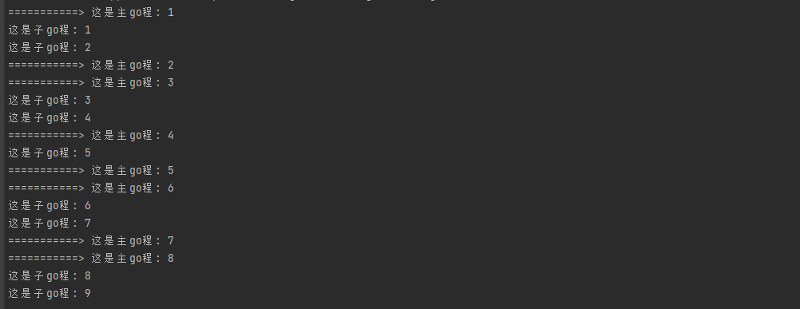

# **基础**

并发：电脑同时听歌、看小说、看电影。CPU根据时间片进行划分，交替执行着三个程序。我们人可以感觉是同时产生的

并行：多个CPU（多核）同时执行

C语言里面实现并发过程使用的是多线程（C++的最小资源单元），进程

go语言里面不是现成，而是go程===> gorebutine，go程是go语言原生支持的

每一个go程占用的系统资源远远小于线程，一个go程大约需要4k-5k的内存资源

一个程序可以启动大量的go程

- 线程==>几十个
- go程可以启动成百上千个==> 对于实现高并发，性能非常好
- 只需要在目标函数前加上go关键字即可实现并发
```go
package main

import (
	"fmt"
	"time"
)

func main() {

	//启动一个子go程
	go display()
	//主go程
	count := 1
	for {

		fmt.Println("===========> 这是主go程:", count)
		count++
		time.Sleep(1 * time.Second)
	}
}

//这个将用于子go程使用
func display() {
	count := 1
	for {
		fmt.Println("这是子go程:", count)
		count++
		time.Sleep(1 * time.Second)
	}
}

```


**启动多个子go程，他们会竞争CPU资源**
```go
package main

import (
	"fmt"
	"time"
)

func main() {

	//启动一个子go程
	for i := 0; i < 3; i++ {
		go display(i)
	}

	//主go程
	count := 1
	for {

		fmt.Println("===========> 这是主go程:", count)
		count++
		time.Sleep(1 * time.Second)
	}
}

//这个将用于子go程使用
func display(num int) {
	count := 1
	for {
		fmt.Println("这是子go程:", num, "当前count为：", count)
		count++
		time.Sleep(1 * time.Second)
	}
}

```


# **提前退出go程**

```go
package main

import (
	"fmt"
	"runtime"
	"time"
)

//GOEXIT：提前退出go程
//return：返回当前函数
//exit：退出当前进程
func main() {
	go func() {
		go func() {
			func() {
				fmt.Println("这是子go程内部的函数")
				//return //这是返回当前函数 1位置会执行
				//os.Exit(-1) //退出进程 1、2、3不执行
				runtime.Goexit() //退出当前子go程，1不执行，2、3执行

			}()
			fmt.Println("子go程结束")   //1
			fmt.Println("go 22222") //4
		}()
		fmt.Println("111111111111   go 1111111") //5
	}()

	fmt.Println("这是主go程")
	time.Sleep(5 * time.Second) //2
	fmt.Println("Over")         //3
}

```


# **无缓存通道**
```go
package main

import (
	"fmt"
	"time"
)

func main() {
	//sync.RWMutex{}
	//当设计到多个go程时，C语言使用互斥量，上锁来保持资源同步，避免资源竞争问题
	//go语言也支持这种方式,但是go语言更好的解决方案是使用管道\通道
	//使用通道不需要我们去进行加解锁
	//A 往通道里面写数据  B 从管道里面读数据  go自动帮我们做好了数据同步

	//创建管道：  创建一个装数字的管道==> channel

	//此时是一个无缓冲的管道
	//numChan := make(chan int) //装数字的管道,使用管道的时候一定要make  同map一样，否则是nil

	//有缓存的管道
	numChan := make(chan int, 10)
	//strChan := make(chan string)  //装字符串的管道

	//创建两个go程，父亲写数据，儿子读数据

	go func() {
		for i := 0; i < 50; i++ {
			data := <-numChan
			fmt.Println("子go程读取数据 ====> data:", data)
		}
	}()

	go func() {
		for i := 0; i < 20; i++ {
			//向管道中写入数据
			numChan <- i
			fmt.Println("子go程2===>:写入数据：", i)
		}
	}()

	for i := 20; i < 50; i++ {
		//向管道中写入数据
		numChan <- i
		fmt.Println("这是主go程:", "写入数据：", i)
	}

	time.Sleep(5 * time.Second)
}

```


# **有缓存通道**
```go
package main

import (
	"fmt"
	"time"
)

func main() {
	//1. 当缓存写满的时候，写阻塞，当被读取后，再恢复写入
	//2. 当缓冲区读取完毕，读阻塞
	//3. 如果管道没有使用make分配空间，那么管道默认是nil的，读取、写入都会阻塞
	//4. 对于管道，读与写的次数对等

	//numsChan := make(chan int, 10)
	var name chan string //默认时nil的
	name = make(chan string, 10)
	go func() {
		fmt.Println("names:", <-name)
	}()
	name <- "hello" //由于name是nil的，写操作会阻塞在这里
	time.Sleep(1 * time.Second)

	numsChan1 := make(chan int, 10)
	//写操作
	go func() {
		for i := 0; i < 50; i++ {
			numsChan1 <- i
			fmt.Println("写入数据：", i)
		}
	}()

	//读，当主程序被管道阻塞，那么程序锁死崩溃
	//要求我们一定要读写次数保持一致
	func() {
		for i := 0; i < 60; i++ {
			data := <-numsChan1
			fmt.Println("读取数据：", data)
		}
	}()
}

```

1. 当管道的读写次数不一致的时候
   1. 如果阻塞在主go程，那么程序会崩溃
   2. 如果阻塞在子go程，那么会出现内存泄露

# **for range管道遍历（解决读写数目不一致）**
```go
package main

import "fmt"

func main() {
	numsChan1 := make(chan int, 10)
	//写操作
	go func() {
		for i := 0; i < 50; i++ {
			numsChan1 <- i
			fmt.Println("写入数据：", i)
		}
		fmt.Println("数据全部写完毕，准备关闭管道！")
		close(numsChan1)
	}()
	//遍历管道时，只返回一个值
	//for range是不知道管道是否写完了，所以会一直在这里等待
	//在写入端，将管道关闭
	for v := range numsChan1 {
		fmt.Println("读取数据：", v)
	}
}

```


# **管道总结**

- 当管道写满了，会写阻塞
- 当缓冲区读完了，会读阻塞
- 如果管道没有使用make分配空间，管道默认是nil
- 如果nil的管道读取数据、写入数据，都会阻塞（注意，不会崩溃）
- 从一个已经close的管道读取数据时，会返回零值（不会崩溃）
- 关闭一个已经close的管道，程序会崩溃
- 向一个close的管道写入数据，程序会崩溃
- 关闭管道的操作一定要在写操作方，否则写端继续写会崩溃
- 读与写的操作一定要对等，否则：
  - 如果阻塞在主go程，那么程序会崩溃
  - 如果阻塞在子go程，那么会出现内存泄露

# **判断管道是否已经关闭**