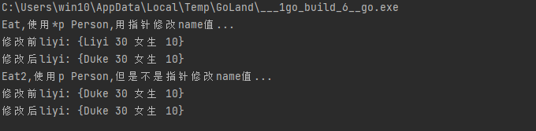
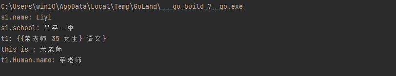
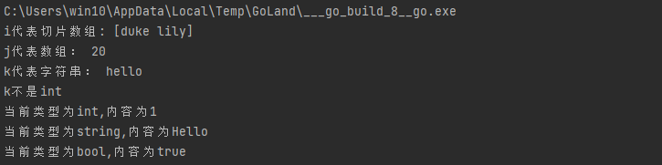
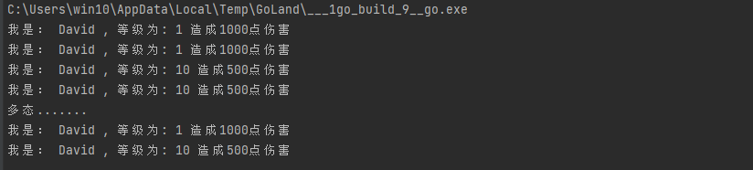

# **GO面向对象**

go语言支持类的操作，但是没有class关键字，使用struct来模拟类

## **类的封装/绑定方法**
```go
package main

import "fmt"

//Person类，绑定方法：Eat Run Laugh
//public private
/* C++语言
class Person{
public:
	string name;
	int age;
public:
	Eat(){
	    xxx
	}
}
*/
type Person struct {
	//成员属性
	name   string
	age    int
	gender string
	score  float64
}

//在类外面绑定方法
func (this *Person) Eat() {
	//fmt.Println("Person is eating")
	////类的方法可以使用自己的成员
	//fmt.Println("Name:", this.name, " is eating!")
	this.name = "Duke"
}

func (this Person) Eat2() {
	//fmt.Println("Person is eating")
	this.name = "liyi"
}
func main() {
	liyi := Person{
		name:   "Liyi",
		age:    30,
		gender: "女生",
		score:  10,
	}

	fmt.Println("Eat,使用*p Person,用指针修改name值...")
	fmt.Println("修改前liyi:", liyi) //liyi
	liyi.Eat()
	fmt.Println("修改后liyi:", liyi) //Duke
	fmt.Println("Eat2,使用p Person,但是不是指针修改name值...")
	fmt.Println("修改前liyi:", liyi) //Duke
	liyi.Eat2()
	fmt.Println("修改后liyi:", liyi) //Duke
}

```



## **类继承**

```go
package main
//1. import ==> 如果包名不同，那么只有大写字母开头的才是public的
//2. 对于类的成员、方法==> 只有大写开头的才能在其他包中使用
import "fmt"

type Human struct {
	//成员属性
	name   string
	age    int
	gender string
}

//在类外面绑定方法
func (this *Human) Eat() {
	fmt.Println("this is :", this.name)
}

//定义一个学生类，去嵌套一个Human
type Student1 struct {
	hum    Human //包含Human类型的变量,此时属于类的嵌套
	school string
	score  float64
}

//定义一个老师，去继承Human
type Teacher struct {
	Human          //直接写Human类型，没有字段名字
	subject string //学科
}

func main() {
	s1 := Student1{
		hum: Human{
			name:   "Liyi",
			age:    18,
			gender: "女生",
		},
		school: "昌平一中",
		score:  0,
	}
	fmt.Println("s1.name:", s1.hum.name)
	fmt.Println("s1.school:", s1.school)

	t1 := Teacher{}
	t1.subject = "语文"
	t1.name = "荣老师" //下面几个字段都是继承字段
	t1.age = 35
	t1.gender = "女生"
	fmt.Println("t1:", t1)
	t1.Eat()

	//继承的时候，虽然我们没有定义字段名字，但是会自动创建一个默认的同名字段
	//这是为了在子类中依然可以操作父类，因为：子类父类可能出现同名的字段或函数
	fmt.Println("t1.Human.name:", t1.Human.name)
}

```


## **Interface（接口）**
```go
package main

import "fmt"

//在C++中，实现接口的时候，使用纯虚函数代替接口
//在go语言中，有专门的关键字interface来代表接口
//interface不仅仅是用于处理多态的，他可以接受任意的数据类型，有点类似void
func main() {
	fmt.Print()
	//定义三个接口
	var i, j, k interface{}
	names := []string{"duke", "lily"}
	i = names
	fmt.Println("i代表切片数组:", i)
	age := 20
	j = age
	fmt.Println("j代表数组：", j)
	s1 := "hello"
	k = s1
	fmt.Println("k代表字符串：", k)
	//我们现在只知道k是一个interface，但是不能明确知道他代表的数据的类型
	kvale, ok := k.(int)
	if !ok {
		fmt.Println("k不是int")
	} else {
		fmt.Println("k是int,值为：", kvale)
	}
	//最常用场景：把interface当成一个函数的参数（类似于print），可以通过switch来判断用户输入的不同类型
	//根据不同类型，做相应逻辑处理

	//创建一个具有三个接口类型的切片
	array := make([]interface{}, 3)
	array[0] = 1
	array[1] = "Hello"
	array[2] = true
	for _, value := range array {
		//可以获取当前接口真正数据类型
		switch v := value.(type) {
		case int:
			fmt.Printf("当前类型为int,内容为%d\n", v)
		case string:
			fmt.Printf("当前类型为string,内容为%s\n", v)
		case bool:
			fmt.Printf("当前类型为bool,内容为%v\n", v) //%v可以自动推导到输出类型
		default:
			fmt.Println("不是合理的数据类型")
		}
	}
}

```

## **多态**

C语言的多态需要父子继承关系

go语言的多态不需要继承，只需要实现相同的接口即可

```go
package main

import "fmt"

//实现go多态，需要实现定义接口
//人类的武器发起攻击，不同等级子弹效果不同

//定义接口类型是interface
type IAttack interface {
	//接口的函数可以有多个，但是只能由函数原型，不能有实现
	Attack()
}

//低等级
type HumanLowLevel struct {
	name  string
	level int
}

type HumanHighLevel struct {
	name  string
	level int
}

func (a *HumanLowLevel) Attack() {
	fmt.Println("我是：", a.name, ", 等级为:", a.level, "造成1000点伤害")
}

func (a *HumanHighLevel) Attack() {
	fmt.Println("我是：", a.name, ", 等级为:", a.level, "造成500点伤害")
}

//定义一个多态的通用接口，，传入不同的对象，调用同样的方法，实现不同的效果  ==>多态
func DoAttack(a IAttack) {
	a.Attack()
}
func main() {

	var player IAttack //定义一个包含Attack的接口变量
	lowlevel := HumanLowLevel{
		name:  "David",
		level: 1,
	}
	highlevel := HumanHighLevel{
		name:  "David",
		level: 10,
	}
	lowlevel.Attack()
	//对player赋值为lowlevel，接口需要使用指针类型来赋值
	player = &lowlevel
	player.Attack()

	player = &highlevel
	highlevel.Attack()
	player.Attack()
	fmt.Println("多态.......")
	DoAttack(&lowlevel)
	DoAttack(&highlevel)
}

```


1. 定义一个接口，里面设计好需要的接口，可以多个
2. 任何实现这个接口的类型，都可以赋值给这个接口，从而实现多态
3. 多个类之间不需要有继承关系
4. 如果interface中定义了多个接口，那么实际的类必须全部实现接口函数，才可以赋值